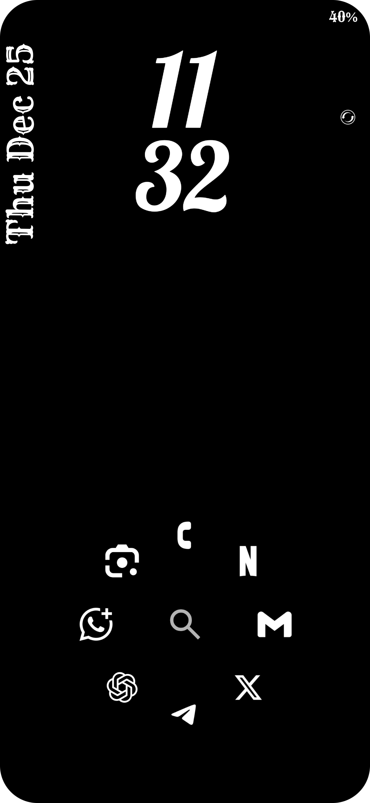
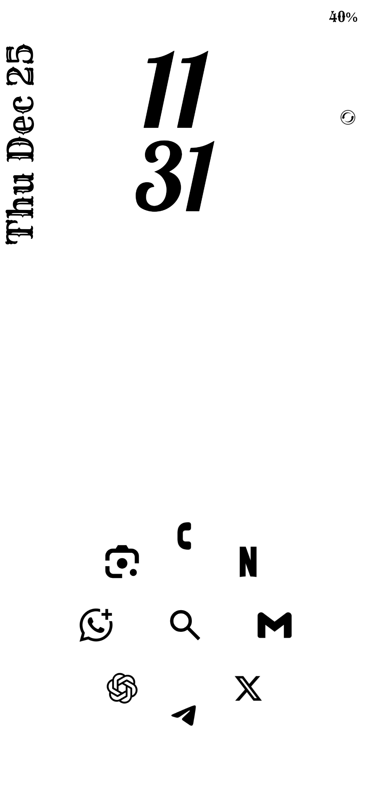
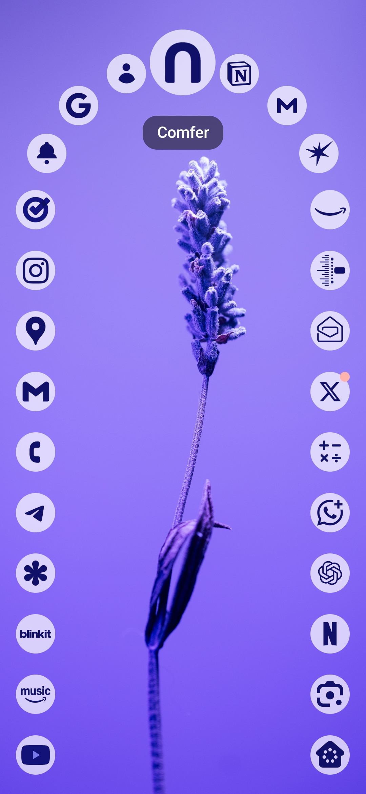

# Comfer Launcher

An open-source Android launcher focus on speed, customization and productivity with swipe gestures.

This repository is an actively maintained fork of [jeerovan/Comfer](https://github.com/jeerovan/Comfer). It keeps upstream history and credits intact while landing fixes, reviewing contributions, and publishing builds from this fork when upstream is quiet.

## Fork Status

- Upstream source: [jeerovan/Comfer](https://github.com/jeerovan/Comfer)
- Maintained fork: [B67687/Comfer](https://github.com/B67687/Comfer)
- Contributions and fixes are welcome here.

## Development

See [CONTRIBUTING.md](CONTRIBUTING.md) for local setup, build commands, and pull request expectations.

## Community

- Read [CONTRIBUTING.md](CONTRIBUTING.md) before opening pull requests.
- Be respectful and collaborative by following [CODE_OF_CONDUCT.md](CODE_OF_CONDUCT.md).

## Releases

This fork can publish GitHub releases directly. Signed release APKs require repository secrets for the Android keystore; otherwise the release workflow still builds artifacts so changes can be verified in CI.

## Screenshots

<table align="center">
  <tr>
    <td></td>
    <td></td>
    <td></td>
    <td></td>
  </tr>
</table>

