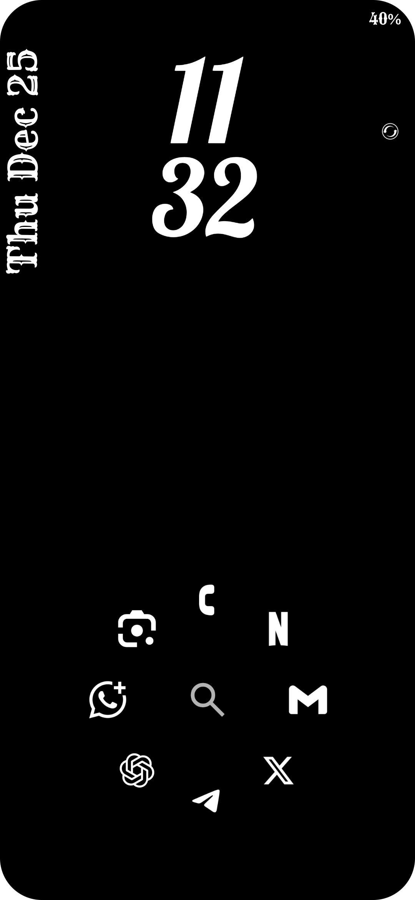
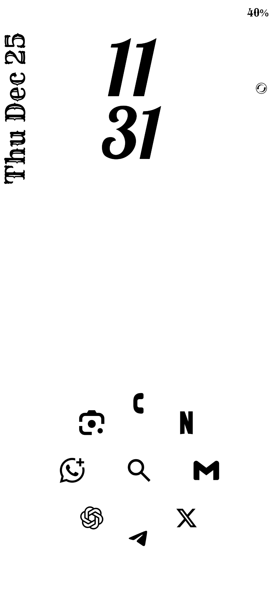
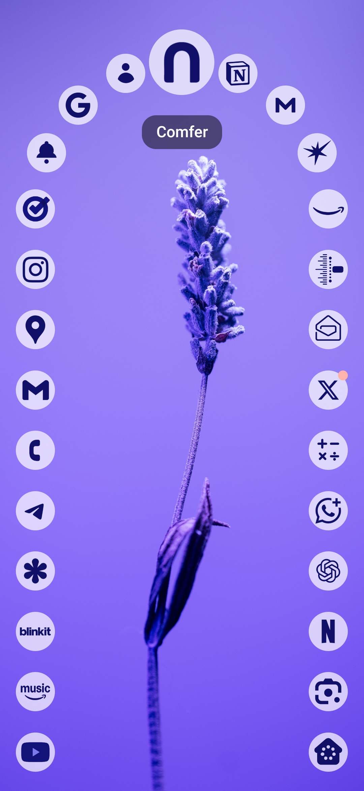

# Comfer Launcher

An open-source Android launcher focus on speed, customization and productivity with swipe gestures.

## Development

See [development progress and next steps](DEVELOPMENT-PROGRESS.md) for the ongoing work log and links to verification and reporting procedures.

## Notification Inbox

See [current features and behavior](Notification-Features.md), [storage and privacy](docs/notifications-storage.md), and [verification instructions](docs/notifications-validation.md).

## Screenshots

<table align="center">
  <tr>
    <td></td>
    <td></td>
    <td></td>
    <td></td>
  </tr>
</table>

